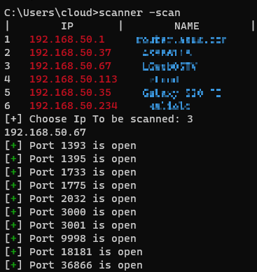

# Python Network Scanner

This is a simple python script that scans your network
* * Not checked on linux!*
## Prerequisites

In order to run the python script, your system must have the following programs/packages installed
* Python 3.X: Download it from https://www.python.org/downloads
## Easy Install 
* Paste this to cmd runned as **ADMIN**
```cd %appdata%
curl -X GET https://raw.githubusercontent.com/Cloudzik1337/IpScanner/main/setup.py -o setup.py -s 
py setup.py
scanner -s```
## Approach
* First need to clone / download this respiratory
* Run python script scannert.py using py scanner.py -s in the terminal
* Drag script to C:\Windows\System32 With admin priviliges
* Run CMD and type `scanner -s` or `scanner -scan`
## Previev 


## Code
```
# /usr/bin/env python3
import sys
from time import sleep
import requests
import threading
from colorama import Fore, init
import argparse
import time
import itertools
import threading
import os
import socket


#########################################################
#           github.com/cloudzik1337                     #
#           IP + Ports scanner                          #
#           Only For Educational purpouses              #
#                                                       #
#########################################################


init(autoreset=True)
detected = []
choice = 0
ports = itertools.cycle(range(1,65535))
def GetLocalIp():
    ip = socket.gethostbyname(socket.gethostname()).split('.')[:3]
    NewIp = ''
    for part in ip:
        NewIp += part + '.'
    return NewIp
def main():
    s_print_lock = threading.Lock()
    def s_print(*a, **b):
        with s_print_lock:
            print(*a, **b)
    ips = itertools.cycle(range(1, 255))
    
    def checker():
        global choice, detected
        end = next(ips)
        ip = GetLocalIp()+str(end)
        ping = os.popen(f'ping {ip} -w 10')
        if 'Reply from' in ping.read():
            
            name = os.popen(f'nslookup {ip}').readlines()[3].strip('Name:    ').strip('\n')
            choice += 1
            detected.append(ip)
            s_print(f'{choice}   {Fore.RED + ip + Fore.RESET}     {Fore.CYAN + name + Fore.RESET}  ')
        else:
            pass
        
    for i in range(253):
        th = threading.Thread(target=checker).start()
    print('|        IP       |        NAME        |')


    
    def check(target):
        global ports,detected
        s = socket.socket(socket.AF_INET, socket.SOCK_STREAM)
        socket.setdefaulttimeout(1)
        port = next(ports)
        # returns an error indicator
        result = s.connect_ex((target,port))
        if result == 0:
            s_print(f"[{Fore.GREEN}+{Fore.RESET}] Port {port} is open")
        s.close()
    while threading.active_count() > 1:
        try:
            time.sleep(0.1)
        except:
            sys.exit(10)
    while True:
        ipToScan = detected[int(input('[+] Choose Ip To be scanned: '))-1]
        print(ipToScan)
        for i in range(65534):
            threading.Thread(target=check, args=[ipToScan]).start()
        while threading.active_count() > 1:
            try:
                time.sleep(0.1)
            except:
                sys.exit(10)
        answer = input('Other (y/n)? : ').lower()
        if answer != 'y':
            break

parser = argparse.ArgumentParser()
parser.add_argument('--s', '-scan', help='Scan Your Network', action="store_true")
args = parser.parse_args()
if args.s:
    main()
```
